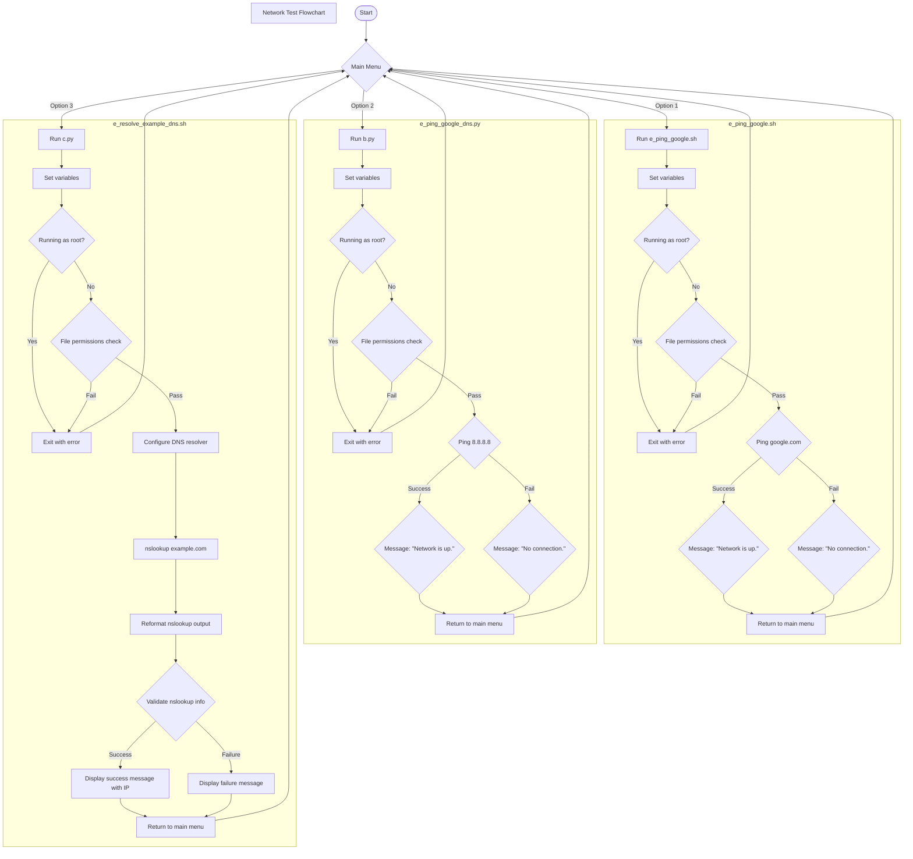

# File: e_flowchart.mmd

Purpose: Flowchart for requirement E1. Created separately from req-e.md to export the flowchart to docx or pdf format.

```mermaid
flowchart TD
    title["Network Test Flowchart"]
    Start([Start]) --> Menu{Main Menu}

    Menu -->|Option 1| A[Run e_ping_google.sh]
    Menu -->|Option 2| B[Run b.py]
    Menu -->|Option 3| C[Run c.py]

    subgraph A_Script [e_ping_google.sh]
        A --> A1[Set variables]
        A1 --> A2{Running as root?}
        A2 --> |Yes| A3[Exit with error]
        A2 --> |No| A4{File permissions check}
        A4 --> |Pass| A5{Ping google.com}
        A4 --> |Fail| A3
        A5 --> |Success| A6{Message: #quot;Network is up.#quot;}
        A5 --> |Fail| A7{Message: #quot;No connection.#quot;}
        A6 --> A8[Return to main menu]
        A7 --> A8
    end

    subgraph B_Script [e_ping_google_dns.py]
        B --> B1[Set variables]
        B1 --> B2{Running as root?}
        B2 --> |Yes| B3[Exit with error]
        B2 --> |No| B4{File permissions check}
        B4 --> |Pass| B5{Ping 8.8.8.8}
        B4 --> |Fail| B3
        B5 --> |Success| B6{Message: #quot;Network is up.#quot;}
        B5 --> |Fail| B7{Message: #quot;No connection.#quot;}
        B6 --> B8[Return to main menu]
        B7 --> B8
    end

    subgraph C_Script [e_resolve_example_dns.sh]
        C --> C1[Set variables]
        C1 --> C2{Running as root?}
        C2 --> |Yes| C3[Exit with error]
        C2 --> |No| C4{File permissions check}
        C4 --> |Pass| C5[Configure DNS resolver]
        C4 --> |Fail| C3
        C5 --> C6[nslookup example.com]
        C6 --> C7[Reformat nslookup output]
        C7 --> C8{Validate nslookup info}
        C8 --> |Success| C9[Display success message with IP]
        C8 --> |Failure| C10[Display failure message]
        C9 --> C11[Return to main menu]
        C10 --> C11
    end

    A3 --> Menu
    B3 --> Menu
    C3 --> Menu
    A8 --> Menu
    B8 --> Menu
    C11 --> Menu
```